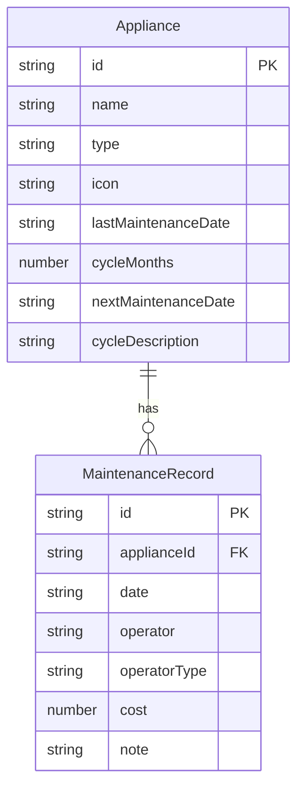

## 1. 架构设计

```mermaid
graph TB
    "Frontend[前端 React+TypeScript]" --> "Store[Zustand 状态管理]"
    "Store" --> "LocalStorage[localStorage 持久化]"
    "Frontend" --> "Pages[页面组件]"
    "Pages" --> "Dashboard[仪表盘]"
    "Pages" --> "ApplianceList[电器管理]"
    "Pages" --> "MaintenanceLog[保养记录]"
    "Frontend" --> "Components[通用组件]"
    "Components" --> "Card[卡片组件]"
    "Components" --> "Modal[模态框组件]"
    "Components" --> "Badge[徽章组件]"
```

## 2. 技术说明

- 前端：React@18 + TypeScript + Tailwind CSS@3 + Vite
- 初始化工具：vite-init
- 后端：无（纯前端应用）
- 数据库：localStorage（浏览器本地存储）
- 状态管理：Zustand（带 persist 中间件自动同步 localStorage）

## 3. 路由定义

| 路由 | 用途 |
|------|------|
| / | 仪表盘，显示提醒概览和快捷操作 |
| /appliances | 电器管理，电器列表与增删改 |
| /logs | 保养记录，历史保养时间线 |

## 4. API定义

无后端API，所有数据通过 Zustand store 直接操作 localStorage。

## 5. 服务端架构图

不适用（纯前端应用）

## 6. 数据模型

### 6.1 数据模型定义



### 6.2 数据定义语言

```typescript
interface Appliance {
  id: string
  name: string
  type: ApplianceType
  icon: string
  lastMaintenanceDate: string
  cycleMonths: number
  nextMaintenanceDate: string
  cycleDescription: string
}

type ApplianceType =
  | 'air_conditioner'
  | 'washing_machine'
  | 'refrigerator'
  | 'range_hood'
  | 'water_heater'
  | 'water_purifier'
  | 'robot_vacuum'
  | 'other'

interface MaintenanceRecord {
  id: string
  applianceId: string
  date: string
  operator: string
  operatorType: 'self' | 'repairman'
  cost: number
  note: string
}

interface ApplianceTemplate {
  type: ApplianceType
  label: string
  icon: string
  defaultCycleMonths: number
  cycleDescription: string
}
```

### 6.3 预设电器模板

| 电器类型 | 标签 | 默认周期(月) | 周期描述 |
|----------|------|-------------|----------|
| air_conditioner | 空调 | 3 | 滤网每3个月清洗 |
| washing_machine | 洗衣机 | 6 | 内筒每6个月清洗 |
| refrigerator | 冰箱 | 6 | 内部每6个月清洁除霜 |
| range_hood | 油烟机 | 3 | 滤网每3个月清洗 |
| water_heater | 热水器 | 12 | 内胆每12个月清洗除垢 |
| water_purifier | 净水器 | 12 | 滤芯每12个月更换 |
| robot_vacuum | 扫地机器人 | 3 | 滚刷尘盒每3个月清理 |
| other | 其他 | 6 | 每6个月保养 |
